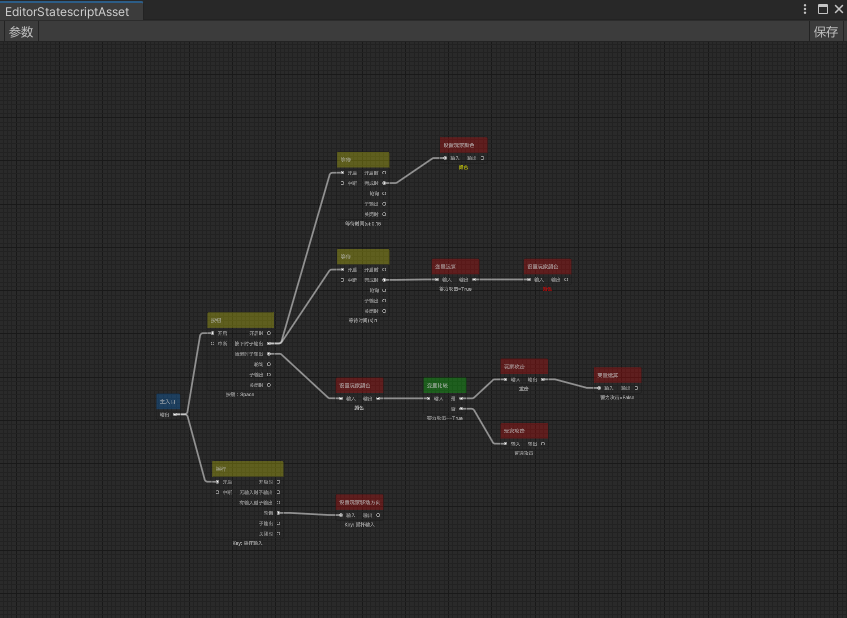
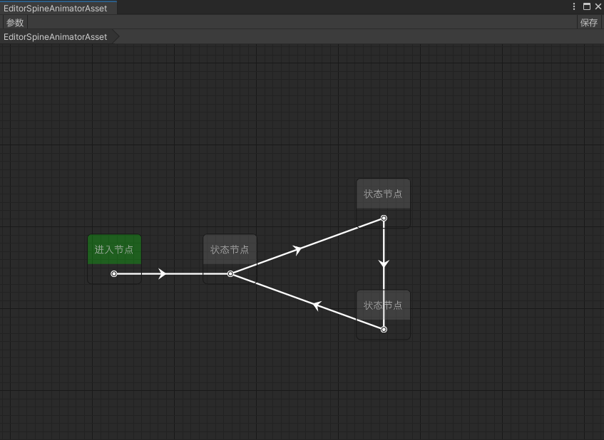
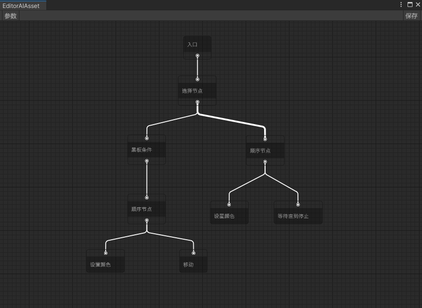
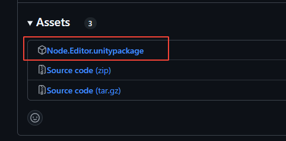
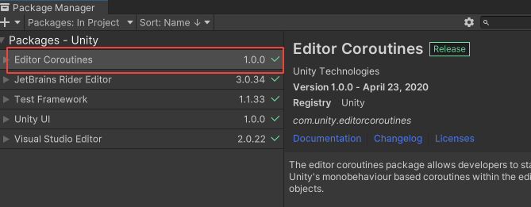

# Emilia-NodeEditor

Emilia-NodeEditor 是基于Unity的UIElements, GraphView实现的节点编辑器框架 它可以用来实现状态机，行为树和流图等编辑器  
纯编辑器实现你可以将它接入你任何的运行时的实现

## 特点

纯编辑器实现  
编辑器使用Odin序列化  
高度可拓展性  
子父级实现  
完整的复制粘贴，撤销实现（快速撤销实现，撤销时不重新加载）  

## 使用Emilia-NodeEditor实现的项目

|名称|描述|图片|  
|----|----|----|
|[流图](https://github.com/CCEMT/Emilia-Flow)|基于源生成无反射流图编辑器实现|
|[状态机](https://github.com/CCEMT/Emilia-StateMachine)|组件式状态机编辑器实现|
|[行为树](https://github.com/CCEMT/Emilia-BehaviorTree)|基于NPBehave的可视化行为树编辑器实现|

## 开始

[快速入门](https://github.com/CCEMT/Emilia-NodeEditor/wiki/Introduction) | [wiki](https://github.com/CCEMT/Emilia-NodeEditor/wiki)

## 安装

Unity版本：2021.3+  
Odin版本：3.1.2+  

### Odin为付费插件请自行导入

### 使用unitypackage安装  

在Tag界面中选择对应版本  [Tag界面](https://github.com/CCEMT/Emilia-NodeEditor/tags)  

#### 找到.unitypackage文件进行下载  

  

#### 导入Unity之后在PackageManager界面中安装Editor Coroutines  

### 使用Unity Package Manager安装  

打开Packages/manifest.json

将以下内容添加进manifest文件中

~~~json
"com.emilia.kit": "https://github.com/CCEMT/Emilia-Kit.git?path=Assets/Emilia/Kit",
"com.emilia.node.editor": "https://github.com/CCEMT/Emilia-NodeEditor.git?path=Assets/Emilia/Node.Editor"
~~~

## 注意事项

该项目还在开发中API可能会产生较大的变化

## 联系

email：1076995595@qq.com  
QQ群：956223592  
