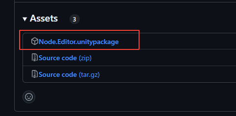
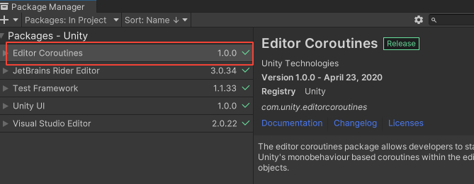
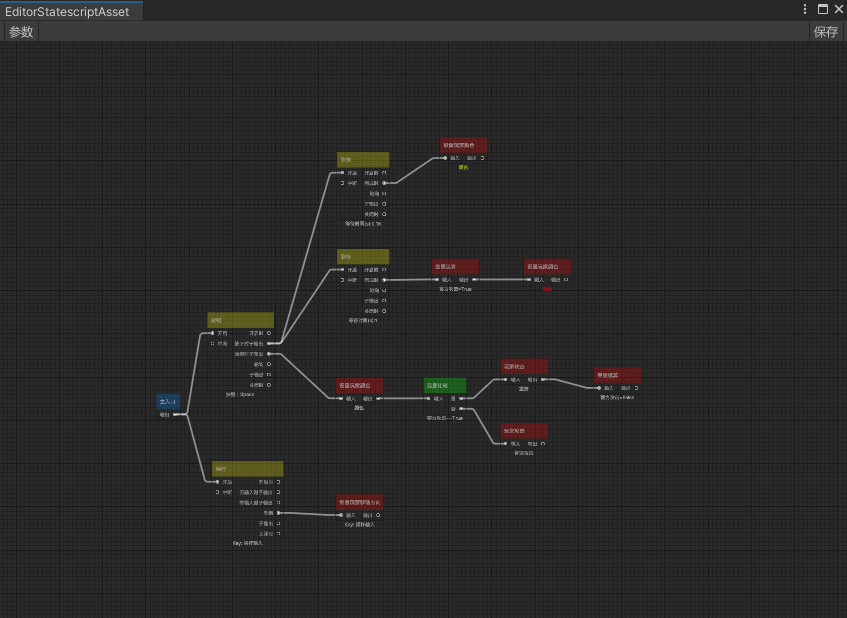
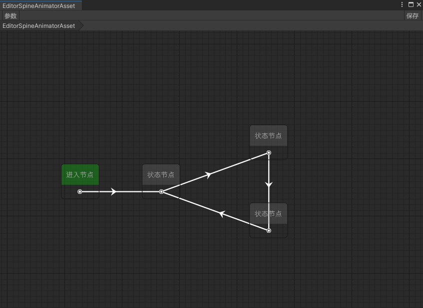
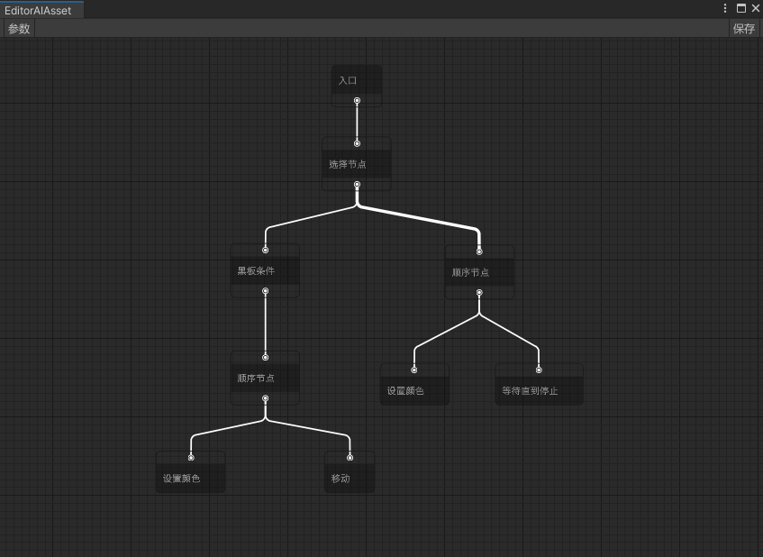

# Emilia-NodeEditor

## 简介

Emilia-NodeEditor 是基于 Unity UIElements/GraphView 的节点编辑器框架。纯编辑器实现，运行时逻辑可由项目自行对接。
编辑器侧数据使用 Odin 序列化，支持扩展节点、端口、面板与操作流程。

## 特性

- 纯编辑器实现，运行时与编辑器逻辑解耦
- 基于 UIElements/GraphView 的节点编辑体验
- Odin 序列化支持（编辑器侧）
- 高度可拓展的节点与面板体系
- 子父级节点体系
- 完整复制粘贴与撤销（快速撤销，不重载）
- 完善的基础设施，可以让使用者快速的实现与节点相关的解决方案

## 安装

运行环境要求：
- Unity 2021.3+
- Odin 3.1.2+

Odin 为付费插件，请自行导入。

### 使用 unitypackage 安装

在 Tag 界面中选择对应版本并下载 `.unitypackage` 文件：
- https://github.com/CCEMT/Emilia-NodeEditor/tags



导入 Unity 后，在 Package Manager 中安装 `Editor Coroutines`：



### 使用 Unity Package Manager 安装

打开 `Packages/manifest.json`，添加以下内容：

```json
"com.emilia.kit": "https://github.com/CCEMT/Emilia-Kit.git?path=Assets/Emilia/Kit",
"com.emilia.node.editor": "https://github.com/CCEMT/Emilia-NodeEditor.git?path=Assets/Emilia/Node.Editor"
```

## 开始

- 快速入门：https://github.com/CCEMT/Emilia-NodeEditor/wiki/Introduction
- 使用指南：https://github.com/CCEMT/Emilia-NodeEditor/wiki/Operating-Guide
- 完整文档：https://github.com/CCEMT/Emilia-NodeEditor/wiki/Document

示例入口：Unity 菜单 `Emilia/AllExampleWindow`（示例集合窗口）。

## 使用 Emilia-NodeEditor 实现的项目

| 名称 | 描述 | 图片 |
| ---- | ---- | ---- |
| [流图](https://github.com/CCEMT/Emilia-Flow) | 基于源生成、无反射流图编辑器实现 |  |
| [状态机](https://github.com/CCEMT/Emilia-StateMachine) | 组件式状态机编辑器实现 |  |
| [行为树](https://github.com/CCEMT/Emilia-BehaviorTree) | 基于 NPBehave 的可视化行为树编辑器实现 |  |

## 联系

- email：1076995595@qq.com
- QQ 群：956223592
